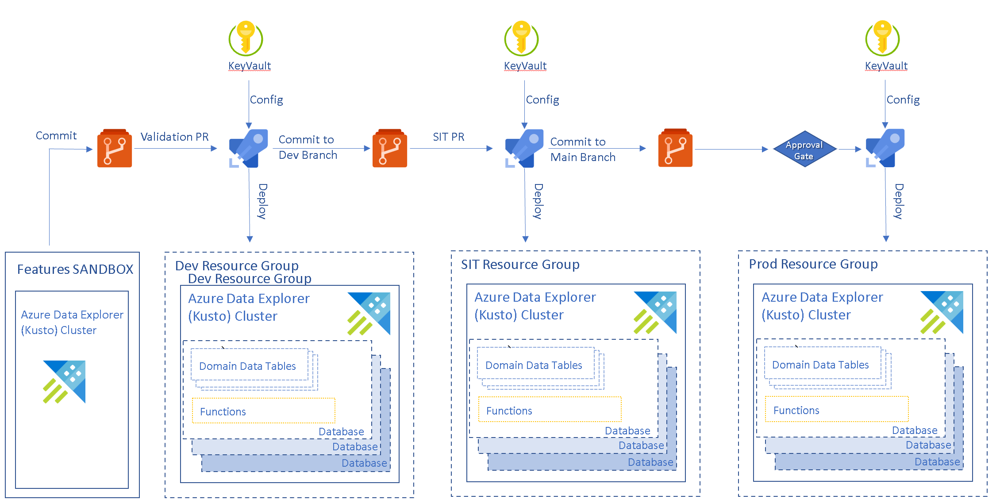

# Azure Data Explorer
[Azure Data Explorer](https://azure.microsoft.com/en-us/services/data-explorer/#features) is a fast, fully managed data analytics service for large volumes of data ingesting from applications, websites, IoT devices, and more. The following sample demonstrates how you can create CI/CD pipelines to provision Azure Data Explorer services and deploy database changes to it.  

## Contents

Contents of this sample includes: 

1. Provision Azure Data Explorer 
2. Create Multi-Tenanet Database and Table 
3. Validate Table/Database creation 

## Solution Overview

This sample demonstrates the CI/CD process to create an multi-tenant Azure Data Explorer cluster. We use [Multi-tenant app with database-per-tenant](https://docs.microsoft.com/en-us/azure/azure-sql/database/saas-tenancy-app-design-patterns#d-multi-tenant-app-with-database-per-tenant) design.   It will create multiple databases on an scalable ADX cluster to provide a cost-effective way of sharing resources across many databases. 

The solution setups up an Azure Data Explorer cluster with multiple databases. Each databases will share same table schema. It also includes ADX configuration file and a key vault for secrets. The table schema of databases are defined in [Kusto query language](https://docs.microsoft.com/en-us/azure/data-explorer/kusto/concepts/#:~:text=Kusto%20query%20language%20is%20primary%20means%20of%20interaction.,queries%20and%20control%20commands%20are%20short%20textual%20%22programs%22.). 

To test and validate the deployment, we will insert sample data into the provisioned tables and validate the result. 

### Architecture 

The following shows the architecture of the Azure Data Explorer multi-tenancy deploy and configure architecture. 

And the following shows CI/CD flow based on the ADX DevOp pipeline.  

### Technologies used
- Azure Data Explorer
- Azure Key Vault 
- Azure DevOps
- Python 
- Powershell Core (run on Ubuntu) 
## Key Learning 

The following summarizes key learnings and best practices demonstrated by this sample solution

1. Use configuration file to store ADX cluster provision parameters

2. Use ADX SDK to automate multi-tenancy resource creation.  

3. Use sample data to test the resource provision result.  
## Key Concepts

1. Azure Data Explorer Configuration settings 

2. Kusto Python SDK  

3. Provision Pipeline 

- Following is the ADX pipeline in the sample

## How to use the sample 

### Prerequests 
- Azure  Account 
- Azure DevOps Account

### Software Prequests
- Azure CLI 
- Powershell Core
- Python 
- Kusto SDK 

### Setup and Deployment

To setup the samples, run the following:

1. Ensure you are logged in to the Azure CLI 

2. Fork and clone this repository. 

### Run the sample

Run setup environment Powershell scripts

Deploy the ADO Pipeline 

Set ADO Pipeline parameters 

Run the ADO pipeline 

### Known Issues, Limitation and Workarounds